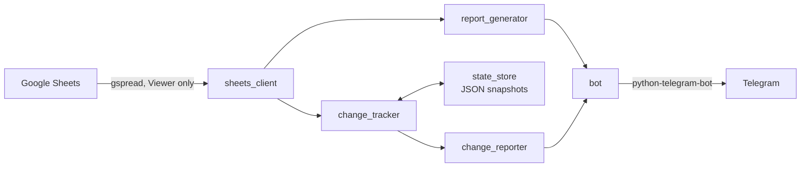

# telegram-report-bot

Turns a shared Google Sheet into daily team status reports on Telegram — so a tech
lead running four concurrent projects never has to write one by hand.


🇻🇳 [Hướng dẫn tiếng Việt đầy đủ →](README.vi.md)

---

## Demo

<!-- Thay dòng dưới bằng ảnh GIF thật: docs/demo.gif -->
> **TODO:** add `docs/demo.gif` — a 10-second capture of `/baocao` producing a report
> in a Telegram group, and one `/moi` change notification.

---

## The problem

I lead a team of six across four concurrent projects. The team tracked work in a
shared Google Sheet, and every day ended the same way: open the sheet, read what
changed, retype it into the team's Telegram group, then write a separate summary
for each person.

None of that produced anything new. It was transcription — and transcription is
exactly the kind of work that quietly eats a lead's evening.

## Why not an off-the-shelf tool

| Option | Why it doesn't fit |
|---|---|
| Google Sheets notification rules | Fire per cell edit. No grouping, no formatting, no sense of "since when" — pure noise in a group chat |
| Zapier / Make | Priced per task, and neither can answer *"what changed since the last bulletin"* without me building the state layer anyway |
| Jira / Asana | The team's real source of truth was the sheet. Migrating the team to a new tool to fix a reporting problem is the wrong trade |

The missing piece in every option was the same: **state**. Reporting a delta means
remembering what the sheet looked like last time. Once I had to build that, the rest
was small.

## What it does

- **Scheduled team reports** into a Telegram group or topic, at a configured time
- **Per-person summaries** delivered privately to the manager at end of day
- **Change tracking** across any number of watched sheets — snapshots each scan and
  reports new rows, deleted rows, deadline changes and reassignments
- **Two-tier alerting** — high-signal changes (deadline moved, owner reassigned) go out
  immediately; everything else is batched into 08:30 and 16:30 bulletins
- **Natural-language queries** in DM — "tiến độ upcode igate" works as well as a slash command
- **Runtime reconfiguration from chat** — change a schedule, group or topic with
  `/cauhinh set`, no redeploy, no SSH
- **Plain-text output** — reports survive copy-paste into any other document

## How it works



| Module | Responsibility | LOC |
|---|---|---|
| `bot.py` | Command handlers, scheduling, natural-language routing | 976 |
| `report_generator.py` | Turning rows into readable reports | 523 |
| `change_tracker.py` | Snapshot diffing, column mapping, filters | 403 |
| `sheets_client.py` | Google Sheets access and normalisation | 296 |
| `change_reporter.py` | Formatting deltas for chat | 116 |
| `state_store.py` | Snapshot persistence | 72 |
| `config.py` | Config load / self-write | 48 |

## Design decisions worth explaining

**Plain text, not Markdown or HTML.** Reports get copy-pasted into meeting notes and
emails. Formatting that looks good in Telegram becomes garbage everywhere else.

**Local JSON snapshots, not Sheets revision history.** The Sheets API exposes revisions
at file granularity, not row granularity. To answer "which task got reassigned" you have
to keep your own before-image. That is what `state_store` is.

**The bot writes its own config file.** Changing tomorrow's report time at 22:00 from a
phone should not require a terminal. `/cauhinh set` mutates `config.yaml` and reloads
the scheduler in place.

**Two tiers of change notification.** A tracker that reports every change the moment it
happens gets muted, and a muted channel is worth nothing. Only two events actually
interrupt someone's day — a deadline moving and an owner changing. Those go out
immediately; everything else waits for a bulletin.

## Quick start

**1 — Create the credentials**

- Telegram bot token from [@BotFather](https://t.me/BotFather)
- A Google Cloud service account with the Sheets API enabled; download its JSON key as
  `credentials.json`
- Share your sheet with the service account email, **Viewer** permission

**2 — Configure**

```bash
cp config.example.yaml config.yaml
```

Fill in `telegram.bot_token`, `telegram.admin_ids`, `google_sheets.spreadsheet_id`
and your schedules.

**3 — Run**

```bash
docker compose up -d --build
```

Or without Docker: `pip install -r requirements.txt && python -m src.bot`

Full setup guide, command reference and troubleshooting: **[README.vi.md](README.vi.md)**

## Commands

Commands are Vietnamese, matching the team that uses it.

| Command | Meaning |
|---|---|
| `/baocao` | Send today's team report now |
| `/canhan` | Per-person summaries for today |
| `/tiendo <keyword>` | Look up task progress |
| `/thanhvien <name>` | One person's work today |
| `/trehan` | Overdue or due today |
| `/tuan` | Weekly roll-up by project and person |
| `/moi` | Changes since the last bulletin |
| `/nguon` | Manage watched sheets (admin) |
| `/cauhinh set <key> <value>` | Change config live (admin) |

## Tests

78 tests covering snapshot diffing, change formatting and state persistence.

```bash
python -m pytest
```

## Stack

Python 3.12 · python-telegram-bot 21.10 · gspread · Google Sheets API · PyYAML ·
pytz · Docker · pytest

## Security notes

- `config.yaml` and `credentials.json` are git-ignored and mounted at runtime — no
  secret ever enters the image or the repository
- Only user IDs listed in `admin_ids` can change configuration
- The service account needs **Viewer** access only; the bot never writes to a sheet
